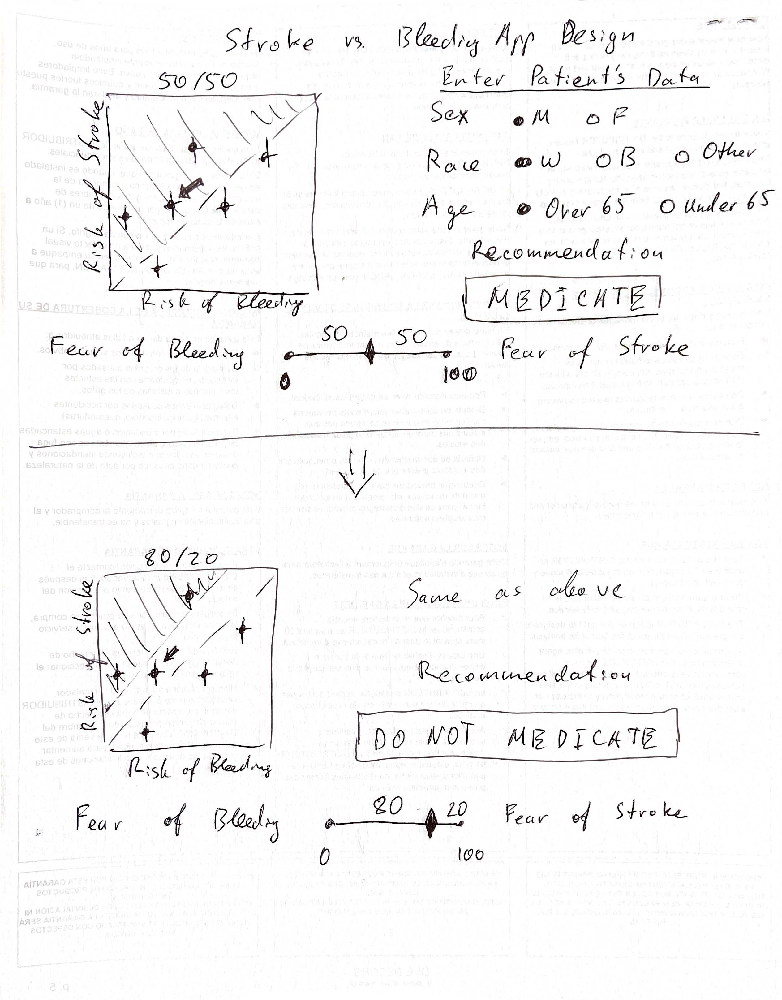

# Stroke vs. Bleeding Shiny App Design Proposal
 
# To Do
1. Work with a stats student (Yayie Duan) to write a Shiny app.  
  
2. After meeting with Javier (01/28/2021):  
  a. Instead of linear regression, use [Deming regression](https://en.wikipedia.org/wiki/Deming_regression)  
  b. Probability of being in the green region based on the confidence intervals (taken care of Deming regression?)  
  c. Think about: ratio of variance (related to Deming regression)  
  
3. After meeting with Cande (01/28/2021):  
  a. Add more variables to the model. I'm thinking of adding CHADSVASC variables and displaying the score additional to the recommendation. We can also extend it to a more comprehensive model and use the app to also demonstrate how the MIDAS-based risk calculator compares to CHADSVASC risk estimation.  
    b. IF we are going to assign probabilities based on confidence intervals (see 'b' above), we can have an internal rule, e.g. if p > 0.5 then medicate, if < then don't). This does not need to be displayed in the app to make it less confusing for the patients.  
    
# Setup
```{r setup}
require(data.table)
require(ggplot2)
require(plotly)
require(deming)
require(MethComp)
```

**ATTENTION!** In ggplot, must explicitly set 'inherit.aes = FALSE', otherwise 'geom_ribbon' expects values for aesthetics from previous geoms (i.e. tt variables ps, pb, etc.). See solution here:  
(geom_ribbon expects an unused y-axis variable to be present)[https://github.com/tidyverse/ggplot2/issues/3364]

# Load data
```{r data}
load("data/tt.RData")
```

# Metod 1: Linear regression
## Run 'lm'
```{r lm}
# Log2-transformed variables
tt[, c("l2pb",
       "l2ps") := list(log2(pb), #xx
                        log2(ps))] #yy
# Regression on log2-transformed variables
m2 <- lm(l2ps ~ l2pb,
         data = tt)
summary(m2)

new_l2pb <- seq(from = 5.5,
                to = 8.75,
                length.out = nrow(tt))
# new_l2pb <- seq(from = 5, 
#                 to = 9,
#                 length.out = nrow(tt))
pi_20_80 <- data.table(predict(m2, 
                               newdata = list(l2pb = new_l2pb),
                               interval = "prediction",
                               level = 0.6))
pi_20_80$l2pb <- new_l2pb
head(pi_20_80)
```

## Plot Fear Bleeding 20 on 0-100 Scale (Log2)
```{r plot_20_80,fig.width=7,fig.height=6}
p1 <- ggplot(tt,
             aes(x = l2pb,
                 y = l2ps,
                 fill = lab)) +
  geom_errorbar(aes(ymin = log2(10^4*(prob.stroke - 1.96*se.stroke)),
                    ymax = log2(10^4*(prob.stroke + 1.96*se.stroke))),
                size = 0.5) +
  geom_errorbar(aes(xmin = log2(10^4*(prob.bleed - 1.96*se.bleed)),
                    xmax = log2(10^4*(prob.bleed + 1.96*se.bleed))),
                size = 0.5) +
  geom_point(shape = 21,
             aes(size = sqrt(N))) +
  geom_abline(slope = m2$coefficients[2],
              intercept = m2$coefficients[1],
              linetype = "dashed") +
  geom_ribbon(data = pi_20_80,
              aes(x = l2pb,
                  ymin = lwr,
                  ymax = 9.25),
              fill = "green",
              alpha = 0.2,
              inherit.aes = FALSE) + 
  scale_x_continuous("Log2 of Bleeding per 10^4 patients",
                      # limits = c(5.5, 8.5),
                     expand = c(0, 0)) +
  scale_y_continuous("Log2 of Stroke per 10^4 patients",
                     # limits = c(3, 9),
                     expand = c(0, 0)) +
  ggtitle("Fear of Bleeding: 20/100\nGREEN = MEDICATE") +
  theme_bw() +
  theme(plot.title = element_text(hjust = 0.5))
ggplotly(p1)
```

## Plot Fear Bleeding 80 on 0-100 Scale (Log2)
```{r plot_80_20,fig.width=7,fig.height=6}
p2 <- ggplot(tt,
             aes(x = l2pb,
                 y = l2ps,
                 fill = lab)) +
  geom_errorbar(aes(ymin = log2(10^4*(prob.stroke - 1.96*se.stroke)),
                    ymax = log2(10^4*(prob.stroke + 1.96*se.stroke))),
                size = 0.5) +
  geom_errorbar(aes(xmin = log2(10^4*(prob.bleed - 1.96*se.bleed)),
                    xmax = log2(10^4*(prob.bleed + 1.96*se.bleed))),
                size = 0.5) +
  geom_point(shape = 21,
             aes(size = sqrt(N))) +
  geom_abline(slope = m2$coefficients[2],
              intercept = m2$coefficients[1],
              linetype = "dashed") +
  geom_ribbon(data = pi_20_80,
              aes(x = l2pb,
                  ymin = upr,
                  ymax = 9.25),
              fill = "green",
              alpha = 0.2,
              inherit.aes = FALSE) + 
  scale_x_continuous("Log2 of Bleeding per 10^4 patients",
                     expand = c(0, 0)) +
  scale_y_continuous("Log2 of Stroke per 10^4 patients",
                     expand = c(0, 0)) +
  ggtitle("Fear of Bleeding: 80/100\nGREEN = MEDICATE") +
  theme_bw() +
  theme(plot.title = element_text(hjust = 0.5))
ggplotly(p2)
```

## Readjust predictions
```{r lm_antilog,fig.width=8,fig.height=6}
new_l2pb <- seq(from = 5,
                to = 9,
                length.out = 10*nrow(tt))
pi_20_80 <- data.table(predict(m2, 
                               newdata = list(l2pb = new_l2pb),
                               interval = "prediction",
                               level = 0.6))
pi_20_80$l2pb <- new_l2pb
head(pi_20_80)
```

## Plot Fear Bleeding 20 on 0-100 Original Scale
```{r plot_antilog_20_80,fig.width=7,fig.height=6}
p1 <- ggplot(tt,
             aes(x = pb,
                 y = ps,
                 fill = lab)) +
  geom_errorbar(aes(ymin = 10^4*(prob.stroke - 1.96*se.stroke),
                    ymax = 10^4*(prob.stroke + 1.96*se.stroke)),
                size = 0.5) +
  geom_errorbar(aes(xmin = 10^4*(prob.bleed - 1.96*se.bleed),
                    xmax = 10^4*(prob.bleed + 1.96*se.bleed)),
                size = 0.5) +
  geom_point(shape = 21,
             aes(size = sqrt(N))) +
  geom_ribbon(data = pi_20_80,
              aes(x = 2^l2pb,
                  ymin = 2^lwr,
                  ymax = 400),
              fill = "green",
              alpha = 0.2,
              inherit.aes = FALSE) + 
  geom_line(data = pi_20_80,
            aes(x = 2^l2pb,
                y = 2^fit),
            linetype = "dashed",
            inherit.aes = FALSE) +
  scale_x_continuous("Bleeding per 10^4 patients",
                     limits = c(50, 400),
                     expand = c(0, 0)) +
  scale_y_continuous("Stroke per 10^4 patients",
                     limits = c(0, 400),
                     expand = c(0, 0)) +
  ggtitle("Fear of Bleeding: 80/100\nGREEN = MEDICATE") +
  theme_bw() +
  theme(plot.title = element_text(hjust = 0.5))
print(p1)
```


## Plot Fear Bleeding 80 on 0-100 Original Scale
```{r plot_antilog_80_20,fig.width=7,fig.height=6}
p2 <- ggplot(tt,
             aes(x = pb,
                 y = ps,
                 fill = lab)) +
  geom_errorbar(aes(ymin = 10^4*(prob.stroke - 1.96*se.stroke),
                    ymax = 10^4*(prob.stroke + 1.96*se.stroke)),
                size = 0.5) +
  geom_errorbar(aes(xmin = 10^4*(prob.bleed - 1.96*se.bleed),
                    xmax = 10^4*(prob.bleed + 1.96*se.bleed)),
                size = 0.5) +
  geom_point(shape = 21,
             aes(size = sqrt(N))) +
  geom_ribbon(data = pi_20_80,
              aes(x = 2^l2pb,
                  ymin = 2^upr,
                  ymax = 400),
              fill = "green",
              alpha = 0.2,
              inherit.aes = FALSE) + 
  geom_line(data = pi_20_80,
            aes(x = 2^l2pb,
                y = 2^fit),
            linetype = "dashed",
            inherit.aes = FALSE) +
  scale_x_continuous("Bleeding per 10^4 patients",
                     limits = c(50, 400),
                     expand = c(0, 0)) +
  scale_y_continuous("Stroke per 10^4 patients",
                     limits = c(0, 400),
                     expand = c(0, 0)) +
  ggtitle("Fear of Bleeding: 80/100\nGREEN = MEDICATE") +
  theme_bw() +
  theme(plot.title = element_text(hjust = 0.5))
print(p2)
```

# Method 2: Deming Regression
*NOTE1*: Deming regression requires standard errors for each point estimate. I do not have these estimates on the log scale. Hence, for the demonstration purposes, I'm showing regression models on the original scale.  
  
*NOTE2*: how to do Deming regression prediction interval?  
  
```{r deming,fig.width=7,fig.height=6}
m1 <- lm(prob.stroke ~ prob.bleed,
         data = tt)
summary(m1)

m2 <- deming(prob.stroke ~ prob.bleed,
             ystd = se.stroke,
             xstd = se.bleed,
             data = tt)
m2

p3 <- ggplot(tt,
             aes(x = prob.bleed,
                 y = prob.stroke,
                 fill = lab)) +
  geom_errorbar(aes(ymin = prob.stroke - 1.96*se.stroke,
                    ymax = prob.stroke + 1.96*se.stroke),
                size = 0.5) +
  geom_errorbar(aes(xmin = prob.bleed - 1.96*se.bleed,
                    xmax = prob.bleed + 1.96*se.bleed),
                size = 0.5) +
  geom_point(shape = 21,
             aes(size = sqrt(N))) +
  geom_abline(intercept = m1$coefficients[1],
              slope = m1$coefficients[2]) +
  geom_abline(intercept = m2$coefficients[1],
              slope = m2$coefficients[2],
              linetype = "dashed") +
  ggtitle("Least Squares (solid line) vs.\n Deming (dashed line) Regression") +
  theme_bw() +
  theme(plot.title = element_text(hjust = 0.5))
print(p3)
```

# Session Information
```{r session}
sessionInfo()
```
